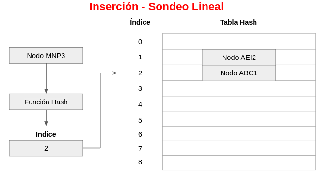

<div align="center">
<table>
    <theader>
        <tr>
            <td></td>
            <th>
                <span style="font-weight:bold;">UNIVERSIDAD NACIONAL DE SAN AGUSTIN</span><br />
                <span style="font-weight:bold;">FACULTAD DE INGENIERÍA DE PRODUCCIÓN Y SERVICIOS</span><br />
                <span style="font-weight:bold;">ESCUELA PROFESIONAL DE INGENIERÍA DE SISTEMAS</span>
            </th>
            <td></td>
        </tr>
    </theader>
    <tbody>
        <tr><td colspan="3"><span style="font-weight:bold;">Formato</span>: Guía de Práctica de Laboratorio / Talleres / Centros de Simulación</td></tr>
        <tr><td><span style="font-weight:bold;">Aprobación</span>:  2022/03/01</td><td><span style="font-weight:bold;">Código</span>: GUIA-PRLD-001</td><td><span style="font-weight:bold;">Página</span>: 1</td></tr>
    </tbody>
</table>
</div>

<div>
<span style="font-weight:bold;">INFORME DE LABORATORIO</span><br />

<table>
<theader>
<tr><th colspan="6">INFORMACIÓN BÁSICA</th></tr>
</theader>
<tbody>
<tr><td>ASIGNATURA:</td><td colspan="5">Estructura de Datos y Algoritmos</td></tr>
<tr><td>TÍTULO DE LA PRÁCTICA:</td><td colspan="5">Hash</td></tr>
<tr>
<td>NÚMERO DE PRÁCTICA:</td><td>07</td><td>AÑO LECTIVO:</td><td>2022 A</td><td>NRO. SEMESTRE:</td><td>III</td>
</tr>
<tr>
<td>FECHA DE PRESENTACIÓN:</td><td>13/08/2022</td><td>HORA DE PRESENTACIÓN:</td><td colspan="3"></td>
</tr>
<tr><td colspan="3">INTEGRANTE(s):
<ul>
<li>Cárdenas Martínez Franco Luchiano - fcardenasm@unsa.edu.pe</li>
<li>Carrillo Daza Barbara Rubi - bcarrillo@unsa.edu.pe</li>
<li>Diaz Portilla Carlo Rodrigo - cdiazpor@unsa.edu.pe</li>
<li>Hancco Condori Bryan Orlando - bhanccoco@unsa.edu.pe</li>
<li>Mamani Cañari Gabriel Anthony - gmamanican@unsa.edu.pe</li>
</ul>
</td>
<td>NOTA:</td><td colspan="2"></td>
</<tr>
<tr><td colspan="6">DOCENTE(s):
<ul>
<li>Richart Smith Escobedo Quispe - rescobedoq@unsa.edu.pe</li>
</ul>
</td>
</<tr>
</tbody>
</table>

<!-- Reportes -->
## SOLUCIÓN Y RESULTADOS
  
---

I. SOLUCIÓN DE EJERCICIOS/PROBLEMAS <br>
* La organización del repositorio es la siguiente
    ```sh
	.
	├── README.md
	└── src
	    ├── HashDemo.java
	    ├── Propuestos
	    │   ├── HashEncadenado.java
	    │   ├── HashSondeo.java
	    │   ├── HashTable.java
	    │   ├── Node.java
	    │   ├── TestEncadenado.java
	    │   └── TestSondeo.java
	    └── User.java
    ```
  * **Nota :** Para los ver los ejercicios propuestos deberá compilar y ejecutar "Test.java".
* Debido a que este laboratorio consistia principalmente en la implementación del Hash, se desarrollaron los dos tipos especificados, en clases separadas
  y en base a los métodos propuestos por la interfaz HashTable. El desarrollo es el siguiente.
  - Implementación de un Hash por Sondeo Lineal (<code>HashSondeo.java</code>).
	- Desarrollo inicial, se agregan 2 atributos, que son la capacidad del arreglo y el arreglo de nodos en sí
	    ```java
		public class HashSondeo <K extends Comparable<K>, V extends Comparable<V>> {
			private final int INITIAL_SIZE;		//la capacidad del arreglo
			private Node<K, V>[] entries;		//Arreglo de nodos
			
			...
		}
	    ```
	- Lo que hace especial a este Hash es como resuelve los conflictos, de manera que, los métodos que se ven afectados son
	    ```java
		public Integer get(K key) {...}
		public Integer put(K key, V value) {...}
		public Integer remove(K key) {...}
	    ```
	- El manejo de los conflictos por cada uno de los métodos es relativamente similar es así que, tomando como ejemplo al desarrollo de
	  <code>put()</code> vemos lo siguiente
	  	
	- Insertando 1ro el nodo ABC1, no ocurren conflictos, por ende, la inserción es directa
		
	- Insertando ahora al nodo AEI2, tampoco ocurren conflictos, por ende, la inserción es directa
		
		
	- Sin embargo, insertando el nodo MNP3, *SI* ocurren conflictos, por ende, la inserción *NO* es directa
		
	- Realizando el proceso de Sondeo Lineal, el nuevo indice pasa a ser 3
		
	- Ya no ocurren conflictos, de manera que ahora el proceso es directo
		
	- Ahora, con el proceso de <code>get()</code>, suceden procesos similares, pues por ejemplo.
	- Basandonos en la estructura desarrollada previamente, buscamos al nodo MNP3, realizada la funcion de hash, nos devolverá el indice 2,
	  indice que no corresponde
		
	- Por ende, tambien es necesario el proceso de Sondeo Lineal
		
	- Y entonces obtendremos el valor que buscamos
	- El proceso de eliminación <code>remove()</code>, realiza basicamente el mismo proceso que <code>get()</code>, con la única excepción
	  de eliminar el nodo al final
	  	
	  	
	  	
  - Implementación de un Hash por Encadenamiento.
  Para la clase HashEncadenamiento se puede resaltar la forma en la que se manejan las coliciones tal y como se menciona en el *topico 2 de la practica* , es por ello que podemos destacar los siguientes metodos:
    ```java
    if (key != null) {
      int index = functionHash(Math.abs(key.hashCode()));
      LinkedList<Node<K, V>> listInPosition = (LinkedList<Node<K, V>>) valores[index];
      if (listInPosition != null) { // Para verificar que la posicion este inicializada
        listInPosition.push(new Node<>(key, value));
      } else { // De otro modo, se inicializa la posicion
        LinkedList<Node<K, V>> addListInPosition = new LinkedList<Node<K, V>>();
        addListInPosition.push(new Node<>(key, value));
        valores[index] = addListInPosition;
      }
      size++;

    } else {
      throw new NullPointerException();
    }
    ```
    
    - En este metodo se asocia el valor con la clave , si ya existe ese valor  el valor se reemplaza por el nuevo valor y se almacena en una lista enlazada.
    ```java
    public V remove(Object key) {
      if (key != null) {
        int index = functionHash(key.hashCode());

        LinkedList<Node<K, V>> listInPosition = (LinkedList<Node<K, V>>) valores[index];

        if (listInPosition != null) {

          for (Node<K, V> aux : listInPosition) {
            if (key.equals(aux.getKey())) {
              listInPosition.remove(aux);
              size--;
              return aux.getValue();
            }
          }
          return null;
        } else {
          return null;
        }

      } else {
        throw new NullPointerException();
      }
     }
     ```
    - En este metodo se busca el registro de la clave , y luego se busca el Nodo en la lista enlazada para desenlazarlo, en caso no se encuentre se lanza una exepcion.
  -  Test, para realizar las pruebas necesarias
     ```java
	 //Código resaltante
     ```
II. CONCLUSIONES
	
- Una tabla hash tiene como principal ventaja que el acceso a los datos suele ser muy rápido, sin importar su tamaño
- Al llegar a tener un factor de carga superior al 5% se vuelven inficientes.
- Se puede aplicar en como un diccionarios ya que ofrece un tiempo de busqueda muy reducido
- Otra potencial aplicacion es administrar elementos de configuración en archivos de configuración Los elementos de configuración son pares clave-valor típicos.

---
    
## RETROALIMENTACIÓN GENERAL
 <pre>
 
 </pre>
---
    
### REFERENCIAS Y BIBLIOGRAFÍA
<ul>
    <li>https://www.w3schools.com/java/</li>
    <li>https://www.eclipse.org/downloads/packages/release/2022-03/r/eclipse-ide-enterprise-java-and-web-developers</li>
    <li>https://docs.oracle.com/javase/tutorial/java/generics/types.html</li>
</ul>
